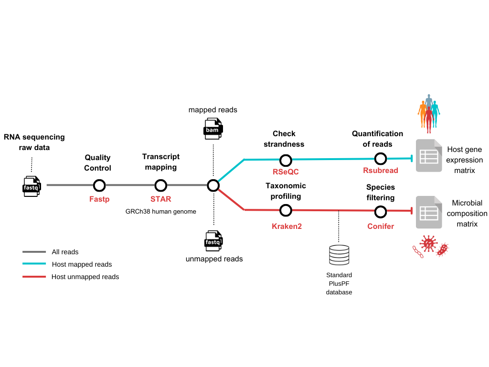

#  

[](https://nf-co.re/phiflow/results)[](https://doi.org/10.5281/zenodo.XXXXXXX)

[](https://www.nextflow.io/)
[](https://docs.conda.io/en/latest/)
[](https://www.docker.com/)
[](https://sylabs.io/docs/)
[](https://tower.nf/launch?pipeline=https://github.com/nf-core/phiflow)

[](https://nfcore.slack.com/channels/phiflow)[](https://twitter.com/nf_core)[](https://mstdn.science/@nf_core)[](https://www.youtube.com/c/nf-core)

## Introduction

**nf-core/phiflow** is a bioinformatics pipeline that simultaneously characterize the microbial composition and host gene expression RNA sequencing samples. Given a list of samples from raw reads as input data (FASTQ) the pipeline performs several steps to produce two data matrices: Host gene expression matrix and Microbial composition matrix. These data matrices can help researchers to investigate the host transcriptome response under the presence of identified microbes and the association of microbial presence with specific host gene modules.


<!-- TODO nf-core:
   Complete this sentence with a 2-3 sentence summary of what types of data the pipeline ingests, a brief overview of the
   major pipeline sections and the types of output it produces. You're giving an overview to someone new
   to nf-core here, in 15-20 seconds. For an example, see https://github.com/nf-core/rnaseq/blob/master/README.md#introduction
-->



<!-- TODO nf-core: Include a figure that guides the user through the major workflow steps. Many nf-core
     workflows use the "tube map" design for that. See https://nf-co.re/docs/contributing/design_guidelines#examples for examples.   -->
<!-- TODO nf-core: Fill in short bullet-pointed list of the default steps in the pipeline -->

1. Read QC ([`fastp`](https://github.com/OpenGene/fastp))
2. Read alignment to the human host genome ([`STAR`](https://github.com/alexdobin/STAR))
3. Infer library strandedness ([`RSeQC`](https://rseqc.sourceforge.net/))
4. Quantify host gene expression ([`subread:featureCounts`](https://github.com/ShiLab-Bioinformatics/subread))
5. Taxonomic profiling of host unmapped reads ([`Kraken2`](https://ccb.jhu.edu/software/kraken2/))
6. Calculate confidence scores from Kraken2 taxonomic profiling ([`Conifer`](https://github.com/ivarz/conifer))
7. Present summary of all previous processing steps ([`MultiQC`](http://multiqc.info/))

## Usage

> **Note**
> If you are new to Nextflow and nf-core, please refer to [this page](https://nf-co.re/docs/usage/installation) on how
> to set-up Nextflow. Make sure to [test your setup](https://nf-co.re/docs/usage/introduction#how-to-run-a-pipeline)
> with `-profile test` before running the workflow on actual data.

<!-- TODO nf-core: Describe the minimum required steps to execute the pipeline, e.g. how to prepare samplesheets.
     Explain what rows and columns represent. For instance (please edit as appropriate):

First, prepare a samplesheet with your input data that looks as follows:

`samplesheet.csv`:

```csv
sample,fastq_1,fastq_2
CONTROL_REP1,AEG588A1_S1_L002_R1_001.fastq.gz,AEG588A1_S1_L002_R2_001.fastq.gz
```

Each row represents a fastq file (single-end) or a pair of fastq files (paired end).

-->

Now, you can run the pipeline using:

<!-- TODO nf-core: update the following command to include all required parameters for a minimal example -->

```bash
nextflow run nf-core/phiflow \
   -profile <docker/singularity/.../institute> \
   --input samplesheet.csv \
   --outdir <OUTDIR>
```

> **Warning:**
> Please provide pipeline parameters via the CLI or Nextflow `-params-file` option. Custom config files including those
> provided by the `-c` Nextflow option can be used to provide any configuration _**except for parameters**_;
> see [docs](https://nf-co.re/usage/configuration#custom-configuration-files).

For more details, please refer to the [usage documentation](https://nf-co.re/phiflow/usage) and the [parameter documentation](https://nf-co.re/phiflow/parameters).

## Pipeline output

To see the the results of a test run with a full size dataset refer to the [results](https://nf-co.re/phiflow/results) tab on the nf-core website pipeline page.
For more details about the output files and reports, please refer to the
[output documentation](https://nf-co.re/phiflow/output).

## Credits

nf-core/phiflow was originally written by Icaro Castro.

We thank the following people for their extensive assistance in the development of this pipeline:

Robert A. Petit III @rpetit3
<!-- TODO nf-core: If applicable, make list of people who have also contributed -->

## Contributions and Support

If you would like to contribute to this pipeline, please see the [contributing guidelines](.github/CONTRIBUTING.md).

For further information or help, don't hesitate to get in touch on the [Slack `#phiflow` channel](https://nfcore.slack.com/channels/phiflow) (you can join with [this invite](https://nf-co.re/join/slack)).

## Citations

<!-- TODO nf-core: Add citation for pipeline after first release. Uncomment lines below and update Zenodo doi and badge at the top of this file. -->
<!-- If you use  nf-core/phiflow for your analysis, please cite it using the following doi: [10.5281/zenodo.XXXXXX](https://doi.org/10.5281/zenodo.XXXXXX) -->

<!-- TODO nf-core: Add bibliography of tools and data used in your pipeline -->

An extensive list of references for the tools used by the pipeline can be found in the [`CITATIONS.md`](CITATIONS.md) file.

You can cite the `nf-core` publication as follows:

> **The nf-core framework for community-curated bioinformatics pipelines.**
>
> Philip Ewels, Alexander Peltzer, Sven Fillinger, Harshil Patel, Johannes Alneberg, Andreas Wilm, Maxime Ulysse Garcia, Paolo Di Tommaso & Sven Nahnsen.
>
> _Nat Biotechnol._ 2020 Feb 13. doi: [10.1038/s41587-020-0439-x](https://dx.doi.org/10.1038/s41587-020-0439-x).
